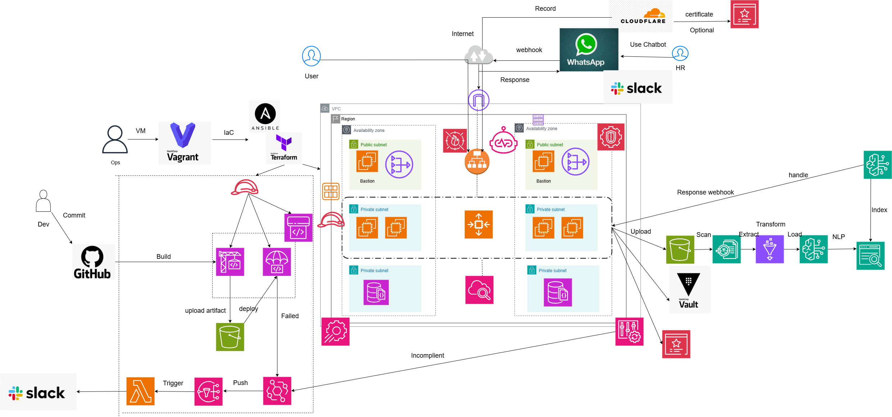

# AI Resume Analyzer & Job Match 🚀

An **AI-powered recruitment assistant** that analyzes resumes (CVs) and automatically recommends the most suitable job positions.  
It leverages **AWS Cloud Services** for scalable storage, data extraction, and AI/ML model inference.

---

## ✨ Features

- 📄 **Resume Parsing** – Upload resumes in PDF format, extract structured data using **Amazon Textract**.  
- 🤖 **AI Skill & Experience Matching** – Process CVs with **AWS Bedrock** to identify candidate skills and compare against job descriptions.  
- 🔍 **Job Search & Ranking** – Store and search job descriptions in **Amazon OpenSearch / Kendra** with semantic search and ranking.  
- 💬 **Chatbot Advisor** – Ask natural language questions like *"Which jobs fit this CV?"* and receive AI-powered recommendations.  
- 📊 **Dashboard** – Upload CVs, view extracted info, and explore the **Top 5 job matches** with detailed reasoning.  

---

## 🏗️ Architecture

- **Frontend:** ReactJS + AWS Amplify / S3 + CloudFront  
- **Backend:** Python FastAPI, AWS Lambda + API Gateway + Step Functions  
- **AI/ML:** Amazon Textract, AWS Bedrock (Claude, Titan) / SageMaker  
- **Database & Search:** S3 (raw files), DynamoDB (metadata), OpenSearch / Kendra (job descriptions), RDS Aurora (structured storage)  
- **Security:** IAM, KMS, CloudTrail, GuardDuty  

---

## 📂 Project Structure

The project is organized as a monorepo architecture with separate frontend and backend, along with Infrastructure as Code and supporting documentation.

```
AI-Resumer-Analyzer-and-Job-Match/
├── frontend/                    # React + TypeScript Frontend
│   ├── public/                  # Static files
│   ├── src/                     # Source code
│   │   ├── components/          # Reusable UI components
│   │   ├── pages/               # Page components
│   │   ├── hooks/               # Custom React hooks
│   │   ├── services/            # API services
│   │   ├── store/               # State management (Zustand/Redux)
│   │   ├── types/               # TypeScript type definitions
│   │   ├── utils/               # Utility functions
│   │   ├── styles/              # Global styles
│   │   └── assets/              # Static assets
│   └── tests/                   # Frontend tests
│
├── backend/                     # Python FastAPI Backend
│   ├── app/                     # Application code
│   │   ├── api/                 # API routes
│   │   ├── core/                # Core configuration
│   │   ├── models/              # Database models
│   │   ├── schemas/             # Pydantic schemas
│   │   ├── services/            # Business logic
│   │   ├── utils/               # Utility functions
│   │   ├── dependencies/        # FastAPI dependencies
│   │   └── middleware/          # Custom middleware
│   ├── alembic/                 # Database migrations
│   ├── tests/                   # Backend tests
│   └── requirements/            # Python dependencies
│
├── infrastructure/              # AWS Infrastructure as Code
│   ├── terraform/               # Terraform configurations
│   ├── cloudformation/          # CloudFormation templates
│   ├── serverless/              # Serverless Framework
│   └── scripts/                 # Infrastructure scripts
│
├── docs/                        # Documentation
│   ├── api/                     # API documentation
│   ├── architecture/            # Architecture docs
│   ├── deployment/              # Deployment guides
│   ├── user-guides/             # User documentation
│   ├── development/             # Developer guides
│   └── images/                  # Images và diagrams
│
├── scripts/                     # Build & deployment scripts
│   ├── setup/                   # Setup scripts
│   ├── build/                   # Build scripts
│   ├── deploy/                  # Deployment scripts
│   ├── test/                    # Test scripts
│   └── utils/                   # Utility scripts
│
├── .github/                     # GitHub Actions CI/CD
│   ├── workflows/               # CI/CD workflows
│   └── ISSUE_TEMPLATE/          # Issue templates
│
├── docker-compose.yml           # Local development setup
├── docker-compose.prod.yml      # Production setup
├── Makefile                     # Common commands
├── package.json                 # Root package.json for scripts
└── README.md                    # Project overview
```

### Organizational Principles

#### Frontend
- **Component-based**: Each component has its own folder with .tsx, .module.css, and index.ts files
- **Feature-based routing**: Pages are organized by feature
- **Shared utilities**: Utils and types are shared across components
- **Atomic design**: Components are structured from atoms to organisms

#### Backend
- **Layered architecture**: API → Services → Models → Database
- **Separation of concerns**: Business logic is separated from API routes
- **Dependency injection**: Uses FastAPI dependencies
- **Configuration management**: Environment-based configuration

#### Infrastructure
- **Infrastructure as Code**: All resources are defined by code
- **Environment separation**: Separate dev, staging, and prod environments
- **Modular design**: Reusable Terraform modules
- **Security first**: IAM roles and policies are clearly defined

---

## 🚀 Development

### System Requirements
- Node.js >= 16.x
- Python >= 3.9
- Docker and Docker Compose

### Local Setup and Development